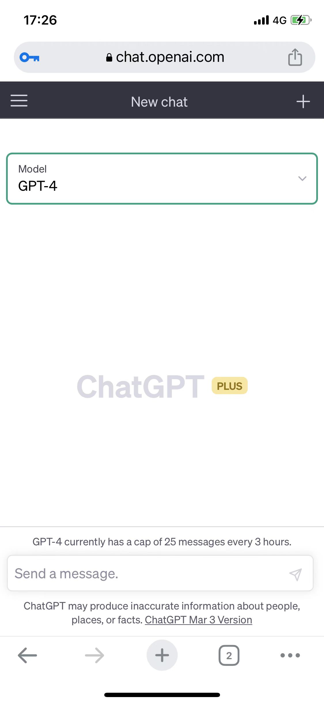
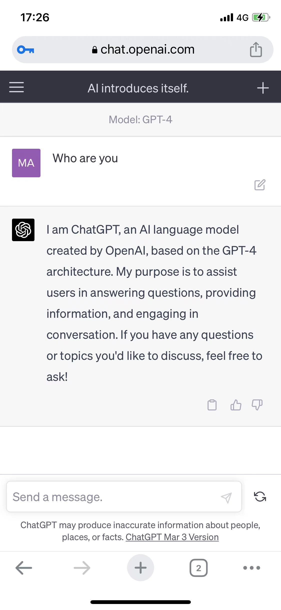
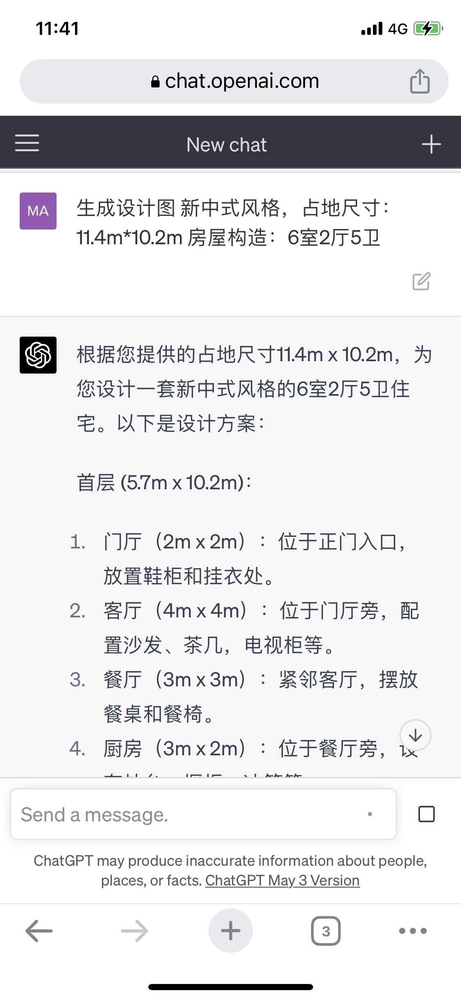
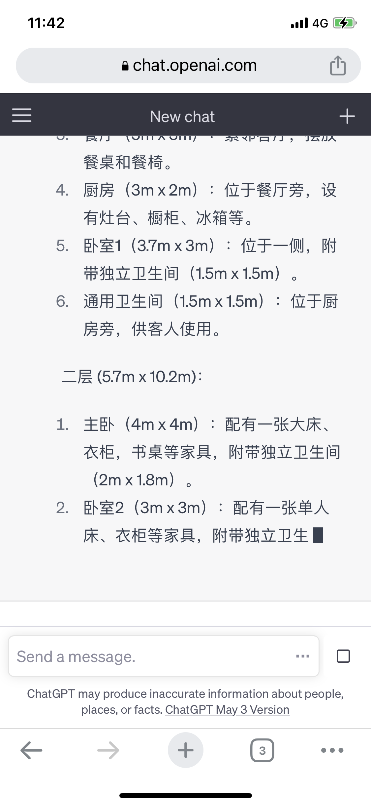
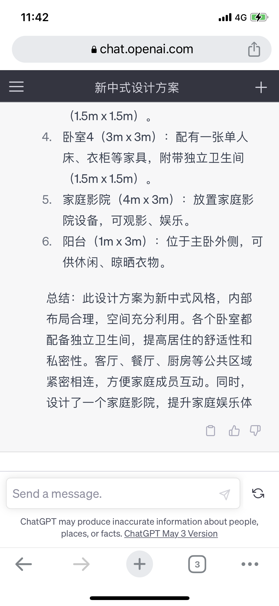
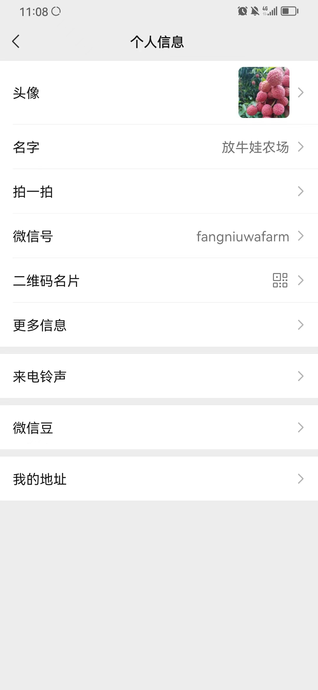

# ChatGPT 

## ChatGPT 使用教程

### 准备工具

1. 翻墙工具
2. 国外手机号，注册时用来接收短信验证码，成功后账号可以免费使用ChatGPT，但是比较慢，高峰时段需要等
3. 国外信用卡，用来充值以便使用ChatGPT4

国内一般都不具备上述条件，需要自己想办法，如果不想麻烦，可以联系本人直接有现成的账号可以使用。

### 使用步骤

1. 浏览器打开ChatGPT官方网站 https://chat.openai.com/ （国内需要先翻墙）
2. 通过注册账号直接体验
3. 需要体验ChatGPT4的需要额外充值，目前是订阅的方式，20美金一个月

### 效果

接下来就可以愉快各种提问了。

例如，想要设计一个超大房子，买不起还是想得起

### 我是广告

想要体验的可以直接联系本人，一起开启AI大航海时代

微信号：fangniuwafarm

## 参考

* [全网爆火的OpenAi！如何注册！](https://zhuanlan.zhihu.com/p/604243836)
* 
* 