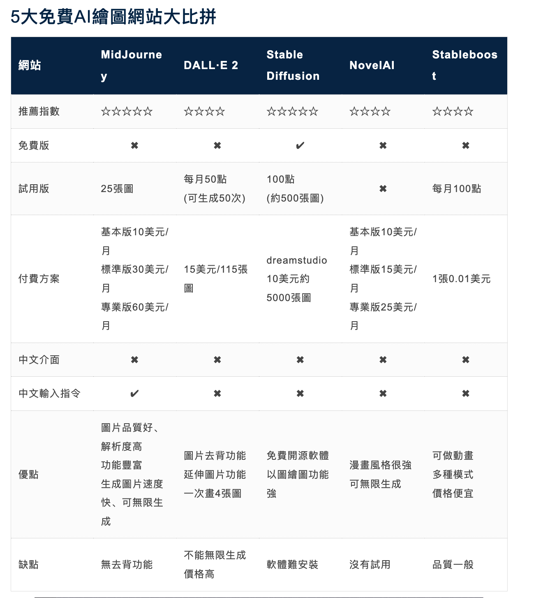

Y 的人工智能学习笔记，记录学习过程中遇到的问题,以及我的一些经验总结。如果出现链接失效等情况可以提交 Issues 提醒我修改相关内容。

> #### PS:点击分类标题可以查看该分类的详细信息。 

******

## [从入门到放弃]()

* 基础篇
   
* 进阶篇    

******

## TODO

******

## [教程类]()

******

## [AI 领域人物]()

******

## [AI 领域](./ai_job.md)

******

## [AI 书籍](./ai_book.md)

******

# Hi AI

## AI 聊天

[ChatGPT](./ChatGPT.md)

## AI 绘画

### [Disco Diffusion](./Disco_Diffusion.md)

简介:这是一款最早流行起来的AI绘图工具，直接在谷歌云端运行的程序，对电脑配置没有要求，用浏览器就可以操作。

Disco Diffusion 是发布于Google Colab 平台的一款利用人工智能深度学习进行数字艺术创作的工具，它是基于MIT 许可协议的开源工具，可以在Google Drive 直接运行，也可以部署到本地运行。
Disco Diffusion 有一个弊端，就是速度非常慢，动辄 半个小时起步。

功能:

仅仅通过文字输入，就能让AI产生相应的输出相应的图片。功能强大，图像生成前需要设置参数，更为灵活。虽然出图比较慢不过图片质量效果惊艳。

Disco Diffusion 是完全免费开源的工具，遵循MIT开源协议，这意味着你可以使用、复制、甚至出售这个工具。理论上Disco Diffusion 生成的图片可以免费商用，但仍存在风险，因此还是不建议商用。

工具网址:github.com/alembics/disco-diffusion

### [Midjourney](./Midjourney.md)

简介:Midjourney 是一款输入文字就可以生成高质量图像的 AI 画画软件，速度达到1分钟出4张图，因为 Midjourney 搭载在 Discord 频道上，所以有非常良好的社区讨论环境。

Midjourney是Disco Diffusion的原作者Somnai所加入的AI艺术项目实验室。
Midjourney 对 Disco Diffusion 进行了改进，平均1分钟能出图。

功能:

这款AI绘画工具的的综合能力全面，图像生成速度极快，相对于Disco Diffusion 上手简单。很多艺术家会使用 Midjourney 生成自己想要图像作为创作灵感参考。

工具网址:https://www.midjourney.com/

公测网址:https://discord.com/invite/midjourney

三、DALL·E2

简介:由 OpenAI 开发的 AI 绘画工具。几分钟能用这款工具创建高度逼真的图像。OpenAI 称，该工具可用于创建插图、设计产品并为业务产生新想法。

OpenAI推出 DALL·E 2, DALL-E 2实现了更高分辨率和更低延迟，而且还包括了新的功能，如编辑现有图像。
目前还没有按到 DALL·E 2 的体验资格。

功能:

整体来说，生成的画作很精准也十分逼真。主要功能包括但不限于输入文字文本就能出图，另外输入文本还能实现抠图、替换图片中的元素。另外，DALL·E2不仅能修改图片局部，还能自动延展图片内容，可以说功能十分强大。

值得注意的是，需要获取 DALL·E 的内测资格才能使用。

内测网址:labs.openai.com/waitlist

工具网址:https://openai.com/dall-e-2/

### [Stable Diffusion](./Stable_Diffusion.md)

stability.ai 推出 Stable-Diffusion并且开源了
一经推出就受到广大网友的喜爱，操作简单，出图快，平均10-20秒。

Stable-Diffusion 免费、生成速度又快，每一次生成的效果图就像是开盲盒一样，需要不断尝试打磨，所以大家都疯狂似的开始玩耍，甚至连特斯拉的前人工智能和自动驾驶视觉总监 Andrej Karpathy 都沉迷于此。

### [AI 绘图网站汇总](./AI_image.MD)

### 各大绘图网站对比

## [关键之匙 Prompt](./prompt.md)

## AI 创业思路

### 提供工具
1. 倒卖 GPTChat 账号
2. 提供国外工具代理
3. 提供使用客户端，包一层壳
4. 提供Prompt
5. 卖资源-图片
6. 卖资源-Prompting
7. 卖资源-视频

### AIGC内容创作

1. AI 绘画 投放平台 抖音、B站、快手
2. AI 视频创作 投放平台 抖音、B站、快手
3. AI 投稿 各大投稿平台 

### 提供教程

上述所有工具操作的教程

## 参考

* [2022年全网最全AI绘画产品整理（一共23款，免费的绘画次数用到你手软）](https://juejin.cn/post/7171423550358683679)

* [如何搭建自己的AI绘画平台](https://juejin.cn/post/7215517443728228410)

******

## 版权声明

* 所有原创文章(未进行特殊标识的均属于原创) 的著作权属于 ** Y敲键盘的地方**。
* 所有转载文章(标题注明`[转]`的所有文章) 的著作权属于原作者。
* 所有译文文章(标题注明`[译]`的所有文章) 的原文著作权属于原作者，译文著作权属于 **Y**。

#### 转载注意事项

除注明外，所有文章均采用 [Creative Commons BY-NC-ND 4.0（自由转载-保持署名-非商用-禁止演绎）](http://creativecommons.org/licenses/by-nc-nd/4.0/deed.zh)协议发布。

你可以在非商业的前提下免费转载，但同时你必须：

* 保持文章原文，不作修改。
* 明确署名，即至少注明 `作者：Y 敲键盘的地方` 字样以及文章的原始链接，且不得使用 `rel="nofollow"` 标记。
* 商业用途请点击最下面图片联系本人。
* 微信公众号转载一律不授权 `原创` 标志。

## 请我喝一杯咖啡

#### 如果你觉得我的文章有帮助的话，请我喝杯咖啡，鼓励我继续研究! 🐾

|                                          |                                          |
| ---------------------------------------- | ---------------------------------------- |
|  |  |

[▲ 回到顶部](#top)
